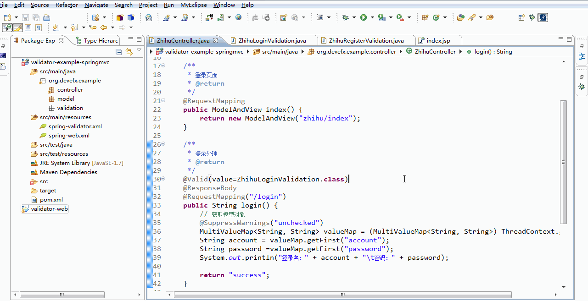

# validator-web

### 特性

- 前后端验证框架，设计精巧、使用简单
- 支持SpringMVC、Struts2、Servlet
- Java验证代码自动生成JavaScript前端验证代码
- 统一前后端验证规范
- 支持自定义验证规则
- 支持对自定义数据验证，默认支持：form、json、xml
- 支持分组验证
- 支持BeanValidation扩展（提供HibernateValidation实现）
- 支持国际化消息模板，模板支持EL表达式

### 安装

```cmd
git clone https://github.com/devefx/validator-web.git
cd validator-web
mvn clean install -Dmaven.test.skip
```

如果你使用 Maven,那么在 pom.xml 中加入下面的代码即可:

```xml
<dependency>
    <groupId>org.devefx</groupId>
    <artifactId>validator-web</artifactId>
    <version>1.0.0-alphal</version>
</dependency>
```

### 配置验证器

以下配置均使用默认配置，为了确保代码在使用模型前已经被执行，请将代码放在ServletContextListener.contextInitialized中保证容器启动完成时被调用（推荐使用Spring进行配置）

```java
ValidatorConfig validatorConfig = new ValidatorConfig();
		
ValidatorFactoryImpl validatorFactory = new ValidatorFactoryImpl();
validatorFactory.setValidatorConfig(validatorConfig);

Validator validator = validatorFactory.buildValidator();

ValidatorUtils.setValidator(validator);
```

### 创建验证模型

```java
import org.devefx.validator.Validation;
import org.devefx.validator.ValidationContext;
import org.devefx.validator.constraints.Email;
import org.devefx.validator.constraints.Length;
import org.devefx.validator.constraints.NotEmpty;
import org.devefx.validator.script.annotation.ScriptMapping;

@ScriptMapping("login")
public class LoginValidation implements Validation {
    @Override
    public void initialize(ValidationContext context) {
        context.constraint("email", new NotEmpty());
        context.constraint("email", new Email());
        context.constraint("password", new NotEmpty());
        context.constraint("password", new Length(4, 20));
    }
}
```

### Java中使用验证模型

SpringMVC 示例（需要配置SpringValidatorInterceptor拦截器）

```java
@Controller
public class LoginController {
   @Valid(value=LoginValidation.class)
   @RequestMapping("/login")
   public void login() {
      // ...
   }
}
```

Struts 示例（需要配置Struts2ValidatorInterceptor拦截器）

```java
public class LoginAction extends ActionSupport {
    @Valid(value=LoginValidation.class)
    public void login() {
       // ...
    }
}
```

Servlet示例（Servlet需要继承AbstractValidatorHttpServlet）

```java
@Valid(value=LoginValidation.class)
@WebServlet(name="loginServlet", urlPatterns="/login")
public class LoginServlet extends AbstractValidatorHttpServlet {
    protected void doGet(HttpServletRequest req, HttpServletResponse resp) throws ServletException, IOException {
        // ...
    }
}
```
### HTML中使用验证模型

如果要在HTML中使用，需要在web.xml中进行配置。 `scan-package`：扫描包里面的 Validation 类，映射出JavaScript验证模型（使用@ScriptMapping注解的Validation才会进行映射）

（springmvc可以简写配置，请参考[SpringMVC Documentation](https://github.com/devefx/validator-web/blob/master/docs/springmvc/getting-started.md)）

```xml
<servlet>
    <servlet-name>scriptSupport</servlet-name>
    <servlet-class>org.devefx.validator.web.servlet.ScriptSupportServlet</servlet-class>
    <init-param>
        <param-name>scan-package</param-name>
        <param-value>org.my.validation</param-value>
    </init-param>
</servlet>
<servlet-mapping>
    <servlet-name>scriptSupport</servlet-name>
    <url-pattern>/va/*</url-pattern>
</servlet-mapping>
```

在HTML代码中加入以下代码，form在提交时若不满足验证模型的约束将会阻止提交并自动提示错误

 （`validate`的使用方法，请参考[JavaScript Documentation](https://github.com/devefx/validator-web/blob/master/docs/validator-js.md)）

```html
<!-- 依赖库 -->
<script type="text/javascript" src="/va/lib/jquery.js"></script>
<script type="text/javascript" src="/va/lib/jquery.form.js"></script>
<!-- 核心库 -->
<script type="text/javascript" src="/va/validator.js"></script>
<!-- 验证器 -->
<script type="text/javascript" src="/va/validation-js/login.js"></script>
<script type="text/javascript">
    $(function() {
    	$("form").validate();
    });
</script>
```

### 演示效果

（以下为 [SpringMVC Example](https://github.com/devefx/validator-web/tree/master/example/springmvc) 的运行效果）



### 配置说明

- [Servlet Configuration](https://github.com/devefx/validator-web/blob/master/docs/servlet/getting-started.md)
- [SpringMVC Configuration](https://github.com/devefx/validator-web/blob/master/docs/springmvc/getting-started.md)
- [Struts Configuration](https://github.com/devefx/validator-web/blob/master/docs/struts/getting-started.md)

### 文档

- [JavaScript Documentation](https://github.com/devefx/validator-web/blob/master/docs/validator-js.md)

### 示例

https://github.com/devefx/validator-web/tree/master/example

### 协议

https://www.apache.org/licenses/LICENSE-2.0.txt
